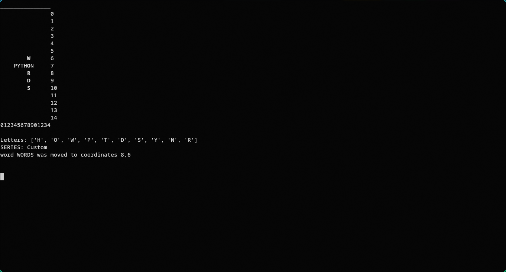
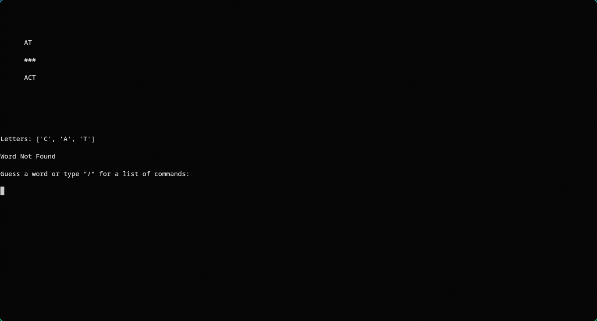

# Python Words

## What is Python Words?

Word Finder is a game that is supposed to be like those word puzzle games on Google Play, only here, you play in a terminal, and you can create your own puzzles if you really wanted to.

## How do you start the game?

To play the game just go to the game directory and run the wordfinder.py file like you would any other python file.

## Dependencies

This game requires Python; I made this using Python 3.12.3, and it will likely work on other version, but I haven't tested Word Finder on any of them.

If you are trying to use the puzzle editor in a Windows system, you will need to install the windows-curses module. You may run the following command to do so:

    pip install windows-curses

## How to play?

Once you run the wordfinder.py file you will be greeted with this screen:

    1: Sample
    2: Custom
    Select a series you want to play:

you may not see the Custom option when you first use it, since this option only appears when you make a puzzle in that directory.

Next, you enter the puzzle number you want to play. This will lead you to a screen like this one:

       #       
       #         
    #####        
     #  ##       
     ## #        
                
                
                
                
                
                
                
                
                
    Letters: ['O', 'G', 'E', '2D']
    Guess a word:

On the top of the screen, you will see the puzzle that you need to solve. Below that, you can see every letter that is used in the puzzle.

\* If you see a number on the left of the letter, that means there is at least one word left in the puzzle that has that many instances of that letter.

## How can I create a puzzle?

Open a file named "puzzle-creator.py" and start work.

When you first start, you will be greeted by this screen:

    _______________                          
                   0                       
                   1
                   2
                   3                                              
                   4                
                   5                  
                   6                    
                   7                
                   8                       
                   9                                                              
                   10
                   11                                  
                   12              
                   13            
                   14                              
    012345678901234                          
                              
    Letters: []                                  
    SERIES: Custom       
    Welcome to Python Words! Type "?" for help   

## How are my puzzles stored?

Sample puzzle data will look something like this:

    {
        "CAT": {
            "direction": "r",
            "x": 6,
            "y": 6
        },
        "ACT": {
            "direction": "r",
            "x": 6,
            "y": 8
        },
        "AT": {
            "direction": "r",
            "x": 6,
            "y": 4
        }
    }

Here we can see that words, coordinates, and direction are shown. The keys in the puzzle object is a word, and the object assigned to the keys give the direction, x, and y coordinates.

